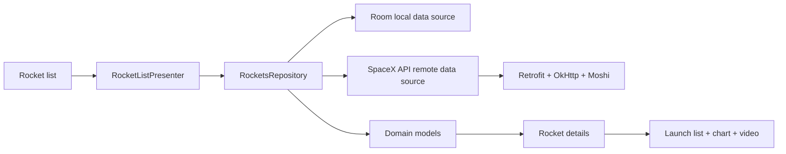

# SpaceX Rocket Launches


SpaceX Rocket Launches is a Kotlin Android showcase app for browsing SpaceX
rockets, launch history, rocket details, and launch media from the SpaceX API.

It was built as a playground for a modular Android architecture with a local
cache, remote API refreshes, presenter-driven UI, custom detail screens, launch
lists, filtering, charts, and video navigation.

## Screenshots

The original screenshots are preserved below.

<p>
  
  
</p>

<p>
  
</p>

<p>
  
  
</p>

## What It Demonstrates

- A modular Android app split into `app`, `rockets`, and `domain` modules.
- SpaceX API integration for rockets and launch history.
- Repository logic that serves cached Room data first and refreshes stale data
  from the network.
- Retrofit services backed by OkHttp and Moshi.
- Room DAOs for rockets and launches.
- Dagger Android dependency injection across activities, fragments, presenters,
  repositories, data sources, and executors.
- MVP-style presenters observing Android lifecycle events.
- Rocket list filtering between all rockets and active rockets.
- Rocket detail screens with launch rows, stats, imagery, and chart data.
- Picasso image loading and YouTube thumbnail handling.
- Unit tests for domain/resource-model mapping helpers and date/time
  extensions.

## App Flow



## Modules

| Module | Purpose |
| --- | --- |
| `app` | Activities, fragments, presenters, Dagger graph, UI models, list adapters, custom views, and resources. |
| `rockets` | SpaceX API service, Room database, local/remote data sources, repository, API/resource models, and data mappers. |
| `domain` | Rocket and launch domain models plus model extension tests. |

## Main Screens

| Screen | What It Shows |
| --- | --- |
| Welcome | Entry experience before exploring rockets. |
| Rocket list | All rockets, active rocket filtering, refresh, retry, and navigation. |
| Rocket details | Rocket imagery, facts, launch data, chart display, and launch video links. |
| Thoughts | Development notes and explanation content. |
| About | Profile and project information. |

## Tech Stack

- Kotlin 1.2.61
- Android Gradle Plugin 3.3.0 alpha07
- Gradle 4.10 RC3
- min SDK 19, target SDK 28, compile SDK 28
- AndroidX 1.0 RC libraries and Material Components
- Dagger 2.17 and Dagger Android
- Room 2.0.0 RC01
- Retrofit 2.4.0, OkHttp 3.11.0, Moshi 1.6.0
- Picasso 2.5.2 with OkHttp downloader
- GraphView 4.2.2
- Data Binding and Kotlin Android Extensions
- JUnit 4 and Hamcrest

## Run It

This repo is pinned to 2018 Android tooling. For the least friction, use an
Android Studio/JDK setup compatible with AGP 3.3 alpha and Gradle 4.10 RC.

```bash
./gradlew :app:assembleDebug
./gradlew :app:installDebug
```

The app targets older SpaceX API v2 endpoints. If those endpoints change or stop
responding, the code still remains useful as a reference for the repository,
cache-refresh, mapping, presenter, and UI patterns.

## Verification

```bash
./gradlew test
```

The existing unit tests cover domain/resource-model extension behavior and
date/time formatting helpers.

## Status

SpaceX Rocket Launches is a historical work-in-progress sample, not an actively
maintained production app. Some of the original future-work ideas were to
simplify singleton usage, improve the rocket detail collapsing toolbar/layout,
replace Dagger with a more Kotlin-friendly DI tool, adopt coroutines, and add
image transitions.

## License

The original README declared this repository to be MIT licensed. A standalone
`LICENSE` file is not currently present in the repository.
